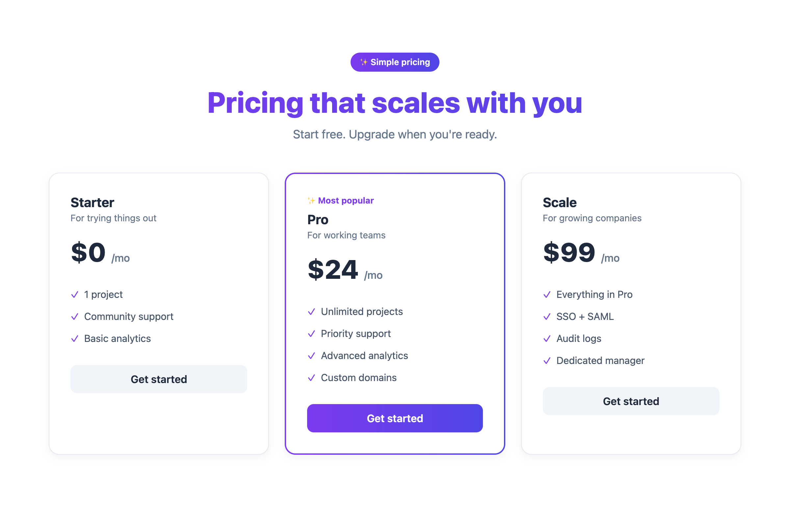
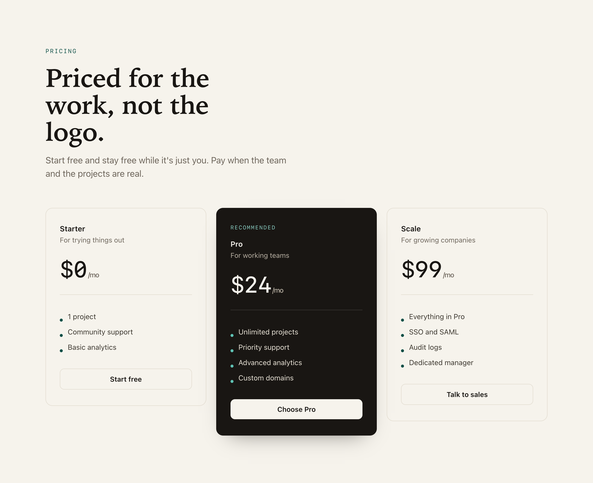

# Taste

A design-engineering standard for Claude. Drop it into a project and Claude does front-end and design work to a senior bar: considered visuals instead of generic defaults, motion that feels right, real accessibility, and the habit most AI design work skips, looking at the rendered result before calling it done.

It is full-spectrum and vendor-neutral, and the depth is not only in motion. Each visual discipline carries the same two layers: a judgment-first summary in the main skill, and a deep execution catalog loaded on demand when a decision needs the exact value. Motion gets the battle-tested recipes (named easing curves, spring physics, interruptible transitions, `clip-path` reveals, GPU and main-thread traps, gesture thresholds) plus the current platform-native layer most guides have not caught up to (View Transitions, scroll-driven animations, animating `height: auto`, discrete-property exits, CSS `linear()` springs). Typography, color, and composition get the same treatment: type scales and pairing and optical correction; OKLCH ramps, tinted neutrals, and dark mode as a remap rather than an inversion; hierarchy, grid, and structure without reflexive cards. Through all of it runs the habit most AI design work skips: judging the result by looking at it rendered, not by reading the values. It teaches the reasoning a senior design engineer uses, not one person's house style, and gives the exact numbers to hit (motion durations, contrast ratios, hit targets, Core Web Vitals), then asks Claude to verify against them.

## Why

Given a UI task with no direction, language models converge on the same look: a default SaaS sans, a purple gradient on white, evenly rounded cards, a centered hero, a sparkle icon on anything related to AI. It is competent and forgettable. Taste pushes past that average.

Two things set it apart. First, it does not stop at animation. A polished transition on top of a generic layout, the wrong typeface, and a broken empty state is still bad work, so the standard covers the whole decision, frame first. Second, it bakes in the one habit that separates code that "looks done" from work that is actually right: render it, screenshot it, compare it to the intent, and fix the gap. No upsell, no course to finish, no gated first response. It just does the work.

## Before and after

The same brief, the same four tiers, the same copy. The only variable is the design judgment. On the left is the look a model reaches for by default. On the right is the pricing page from a real product, the same standard applied.

| Without the skill | With the skill |
| --- | --- |
|  |  |

What changed, and why:

- **Type carries the signal.** One SaaS sans doing every job becomes a tight display face for the headline and prices with small tracked labels for the metadata. The contrast lives between roles, not in a single weight straining to do all of it.
- **Weight maps to truth.** Four near-identical cards with a colored border on the "popular" one become a layout that actually points: the recommended tier gets the tinted panel, a slow beam tracing its edge, and the only saturated button, while the rest stay quiet. The page guides instead of decorating.
- **A detail language.** Solid pill features and a drop shadow under every card become dashed-outline capability chips, hairline dividers, and small corner registration marks on one bordered table. It reads as built, not assembled.
- **Restraint with the brand color.** A gradient slathered across the heading and every button becomes one committed hue used at full strength only where it earns attention. Note that the "after" is still purple. Killing the generic default is about consideration, not banning a color; the difference is using it on purpose.

The "after" is a faithful standalone build of a live product's pricing page, so this is craft on a real surface, not a toy made to win the comparison. The point is the judgment, not these exact pixels. Source for both is in [`demo/`](demo).

That beam on the recommended tier is real motion, not a painted-on glow:


It is the kind of motion the standard argues for: an animated registered `@property` angle driving a masked conic gradient, slow and quiet so it guides the eye to one tier without nagging, and switched off entirely under `prefers-reduced-motion`.

## What is inside

```
skills/design-engineering/SKILL.md        The standard itself, ready to use as a skill
skills/design-engineering/MOTION.md        Deep motion catalog, loaded on demand
skills/design-engineering/TYPOGRAPHY.md    Deep type catalog, loaded on demand
skills/design-engineering/COLOR.md         Deep color catalog, loaded on demand
skills/design-engineering/COMPOSITION.md   Deep layout catalog, loaded on demand
skills/design-review/SKILL.md              Companion review skill, invoked explicitly when you want a critique
.claude-plugin/plugin.json                 Plugin manifest, for installing as a Claude plugin
README.md                                  This file
LICENSE                                    MIT
```

The standard covers how to operate (frame first, kill the generic default, verify with your own eyes, finish the sweep), avoiding generic design, motion and animation, micro-interactions, interaction details, visual craft, accessibility, performance, and a pre-ship checklist. Each visual discipline keeps a judgment-first summary in the main skill and a deep execution catalog beside it, loaded only when a decision needs the exact value, so the main skill stays lean:

- `MOTION.md`: named easing curves, spring configs, `@starting-style` and WAAPI, `clip-path` reveals, blur-masked crossfades, gesture thresholds, the 2026 platform-native layer, debugging.
- `TYPOGRAPHY.md`: type scales by ratio, pairing rules, optical tracking, widow control, tabular figures, OpenType features, variable fonts, flash-free font loading.
- `COLOR.md`: OKLCH ramps and tinted neutrals, semantic tokens, dark mode as a remap not an inversion, contrast in practice, `color-mix` and relative color.
- `COMPOSITION.md`: hierarchy and the one entry point, the column grid, whitespace versus deliberate density, scannability, alignment, structure without reflexive cards.

A second skill, `design-review`, reviews a diff against the same bar and returns a findings table plus an explicit Block or Approve verdict. It does not auto-trigger; pull it in when you want a critique rather than a build.

## Install

Pick whichever fits how you use Claude. All are portable across stacks.

**1. With the skills CLI (recommended).** [`npx skills`](https://github.com/vercel-labs/skills) installs straight from this repo and works across Claude Code, Cursor, Codex, and more. No clone, no registration.

```bash
# the standard
npx skills add GambogeSplash/taste --skill design-engineering

# the standard plus the companion review skill
npx skills add GambogeSplash/taste --skill '*'

# install for every project on your machine
npx skills add GambogeSplash/taste --skill design-engineering -g
```

It loads only when the work is actually design or front-end, so it never bloats unrelated sessions. Claude picks it up automatically when you ask for UI, frontend, components, animation, or visual design.

**2. By hand, as a skill.** Copy the folder into your project (or your home config) if you would rather not use the CLI:

```bash
# project-local
cp -r skills/design-engineering .claude/skills/

# or for every project on your machine
cp -r skills/design-engineering ~/.claude/skills/
```

**3. As an always-on rule.** Put it where Claude reads project rules, optionally scoped to front-end files so it only loads when relevant:

```bash
cp skills/design-engineering/SKILL.md .claude/rules/design-engineering.md
```

**4. From CLAUDE.md.** Keep `CLAUDE.md` short and import the standard so the detail lives in one place:

```markdown
@skills/design-engineering/SKILL.md
```

**5. As a Claude plugin.** This repo ships a `.claude-plugin/plugin.json` manifest, so it can be installed as a plugin and both skills are registered automatically. Point your plugin install at this repo.

## Using it

Once installed, work normally. Ask Claude to build, review, or refine an interface and it will apply the standard, including the render-and-compare verification loop. To pull it in explicitly, mention design, frontend, UI, animation, or visual work, or reference the skill by name.

## Extending it

Keep it focused. Add a rule when you have actually watched the work go wrong, not speculatively, and cut any line whose removal would not change the output. Long always-loaded files dilute the rules that matter, which is exactly why the detail lives in a skill that loads on demand.

## License

MIT. See [LICENSE](LICENSE). Use it, fork it, adapt it to your own taste.

By [John Wright-Nyingifa](https://twitter.com/itriple9) ([@itriple9](https://twitter.com/itriple9)).
